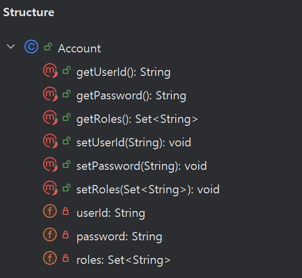
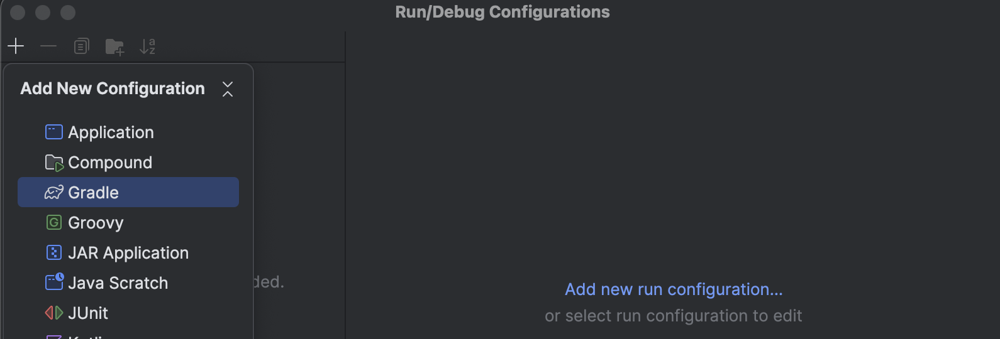
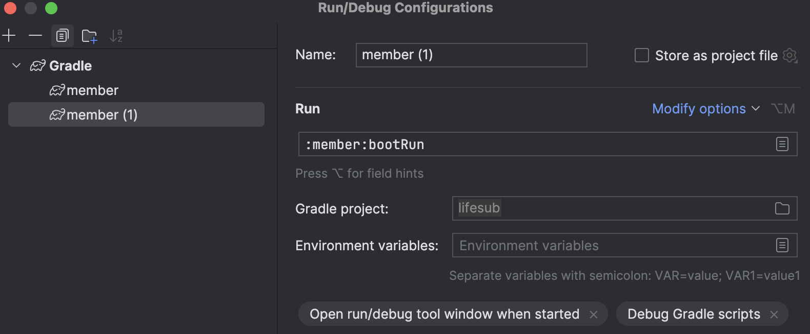
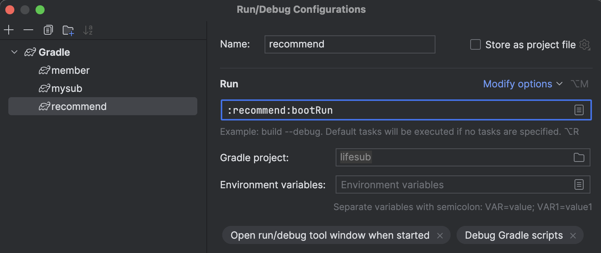
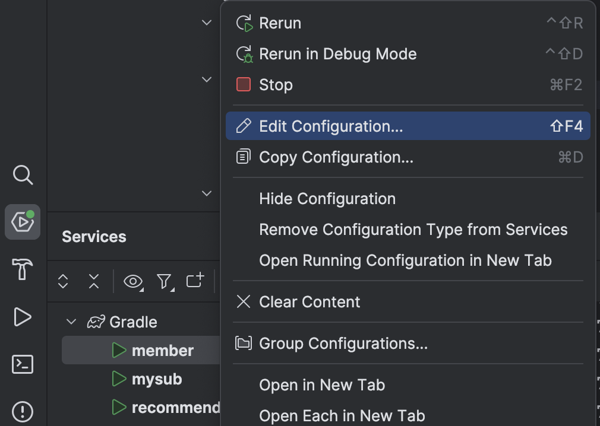
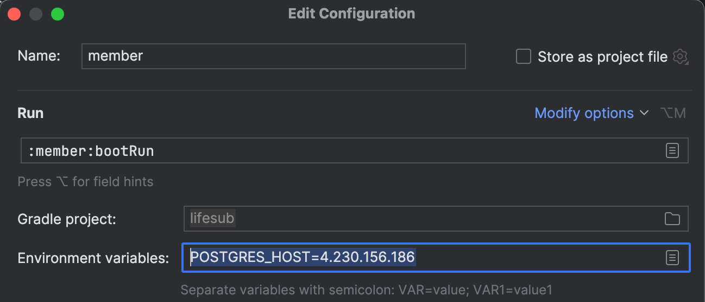
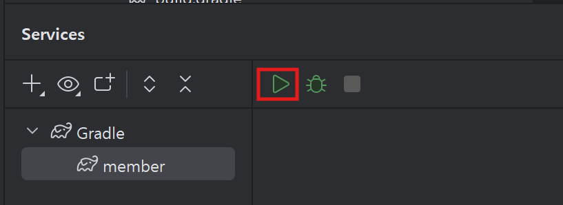
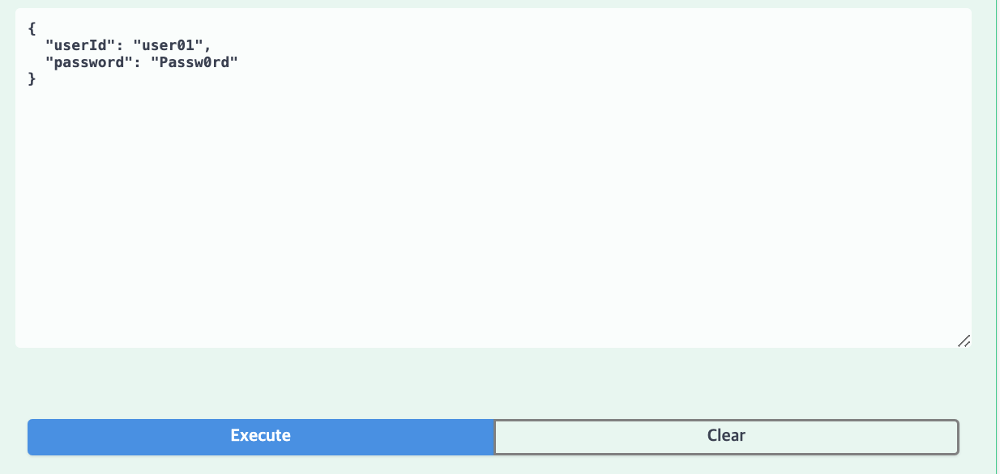
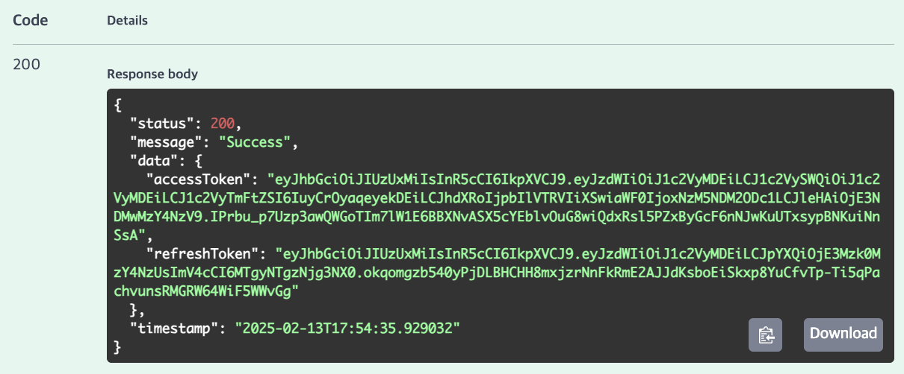
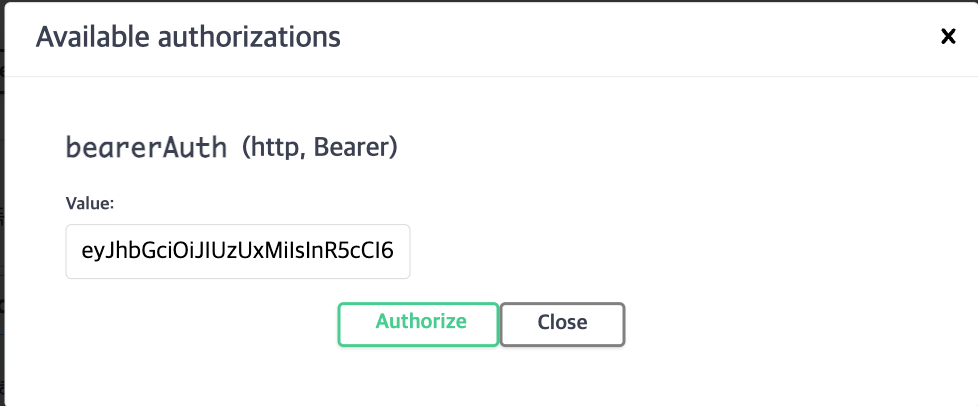

# Backend Coding 가이드 

## 목차
- [Backend Coding 가이드](#backend-coding-가이드)
  - [목차](#목차)
  - [사전준비](#사전준비)
  - [개발](#개발)
  - [주요 소스 이해](#주요-소스-이해)
    - [설정 파일](#설정-파일)
    - [최상위 프로젝트 빌드 스크립트](#최상위-프로젝트-빌드-스크립트)
    - [소스 보는 Tip](#소스-보는-tip)
    - [인증하기](#인증하기)
    - [AOP(Aspect Oriented Programming)를 이용한 Logging 공통모듈 추가](#aopaspect-oriented-programming를-이용한-logging-공통모듈-추가)
    - [JPA 설정 이해](#jpa-설정-이해)
  - [AKS/ACR 생성](#aksacr-생성)
  - [Database 설치](#database-설치)
  - [실행하기](#실행하기)
  - [테스트](#테스트)
    - [member 서비스](#member-서비스)
    - [recommendation 서비스](#recommendation-서비스)
    - [mysub 서비스](#mysub-서비스)

---

## 사전준비
기존 설계 산출물을 이용해서 개발을 진행하셔도 되는데,   
기존에 설계 산출물 검토가 충분히 안되었다면,  
가이드 '1.develop > 1.2 coding'디렉토리에 있는 아래 산출물을 파일명과 동일하게 Knowledge에 등록하십시오.  
기존에 작업한 설계 산출물은 백업하거나 필요 없으면 지우세요.  
- 논리아키텍처
- API설계서
- Sequence 설계서
- Class 설계서
- Data 설계서
- 물리아키텍처
 
 가이드 '1.develop > 1.2 coding'디렉토리에 있는 'sample_project.java'도 등록합니다.  
 

## 개발

- 코딩 
  ```
  c: 백엔드 개발을 시작해 주세요. 개발 방식은 WebMVC를 사용하세요. 
  ```   
- 프로젝트 생성
  윈도우 사용자는 local ubuntu에서 작업하고 맥 사용자는 로컬 터미널에서 작업합니다. 
  작업 디렉토리를 생성합니다. {사용자홈}/home/workspace를 작성합니다. 
   
  ```
  mkdir -p ~/workspace 
  cd ~/workspace
  ```

  개발된 소스를 한 파일로 합칩니다. 'workspace'디렉토리에 만들고 파일명은 'src.txt'로 합니다.    
  genprj.py를 이용하여 프로젝트를 생성합니다.  
  ```
  $ python genprj.py src.txt lifesub m
  ```

  intelliJ에서 프로젝트를 오픈 합니다. 

- 프로그램 보완
  1차 코딩 완료 후 실행을 위한 모든 코드가 개발되었는지 체크
  ```
  o: 실행을 위해 필요한 모든 클래스가 개발되었는지 체크해 주세요.
  ```

  2차 코딩 완료 후 재 확인
  ```
  o: 다시 한번 누락된 클래스가 없는지 검토해 주세요.
  ```

- 에러 Fix
  IntelliJ에서 에러 텍스트를 복사하거나, 이미지 캡처하여 제공  
  반드시, 제일 상단에 있는 class명이 포함되게 캡처 해야 함  
    
  
> Tip: 예제 코드  
>   
> 시간이 없거나 에러가 잘 안 잡히면 아래 소스를 이용하여 실습을 하십시오.  
> 예제 소스는 아래와 같이 다운로드 할 수 있습니다.   
> ```
> cd ~/workspace  
> git clone https://github.com/cna-bootcamp/lifesub.git  
> ```


| [Top](#목차) |

---

## 주요 소스 이해  
### 설정 파일 
- settings.gradle: 멀티 프로젝트에서 하위 모듈(프로젝트)을 관리하는 파일
- build.gradle: 프로젝트 기본정보와 라이브러리를 정의하는 파일
- application.yml: 프로젝트의 환경설정을 정의하는 파일  


### 최상위 프로젝트 빌드 스크립트  
build.gradle은 애플리케이션의 기본정보와 라이브러리등을 정의한 파일입니다.   
Node.js계열의 언어(React, view.js등)에서의 package.json과 동일한 기능을 합니다.   
컴파일러로 maven을 사용할때는 pom.xml에 XML형식으로 정의해야 합니다.    
gradle을 점점 더 많이 쓰는 이유는 build.gradle에 정의하는 것이 훨씬 간단하고,   
컴파일 속도도 더 빠르기 때문입니다.   

- plugins
  java와 spring boot 플러그인을 지정합니다.   
  실습에서는 Spring Boot 3.4.0을 사용합니다.   
  Spring Boot 라이브러리 관리 플러그인은 정의 안합니다.  
  Spring Boot 버전에 맞는 라이브러리 관리 플러그인 버전을 지정해야 하는데 잘못 지정하면 문제 생기므로    
  Spring Boot가 알아서 맞는 버전을 로드하도록 하는게 편합니다.     
  ```
  plugins {
      id 'org.springframework.boot' version '3.4.0' apply false
      //id 'io.spring.dependency-management' version '1.1.6' apply false
      id 'java'
  }
  ```
- allprojects  
  Root 프로젝트를 포함 모든 서브 프로젝트에 적용할 설정만 적용합니다.  
  package그룹, 버전, Java 컴파일러 버전을 지정합니다.     
  ```
  allprojects {
      group = 'com.unicorn'
      version = '1.0.0'
      sourceCompatibility = '21'
  }
  ```

- subprojects   
  하위 프로젝트에 적용될 설정을 합니다.   

  - Spring Boot 플러그인을 적용합니다.  
  ```
  subprojects {
    apply plugin: 'java'
    apply plugin: 'org.springframework.boot'
    apply plugin: 'io.spring.dependency-management'
  }
  ```

  - 라이브러리 저장소 
    라이브러리를 다운로드할 저장소로 maven central을 지정했습니다.   
    https://mvnrepository.com/repos/central 에서 라이브러리를 다운로드 하게 됩니다.   
    ```
    repositories {
        mavenCentral()
    }
    ```

    실제로는 Nexus나 jFrog등의 툴을 이용하여 라이브러리 저장소를 운영하기도 합니다.   
    그런 경우는 아래 예제와 같이 라이브러리 저장소의 주소를 따로 지정해 줍니다.   

    ```
    repositories {
        maven {
            url "https://nexus.example.com/repository/maven-public/"
            credentials {
                username "your-username"
                password "your-password"
            }
        }
    }
    ```

  - 라이브러리 정의   
    dependencies 하위에 모든 프로젝트에서 사용할 라이브러리를 정의 합니다.   
    'implementation'으로 정의된 라이브러리는 애플리케이션 컴파일과 실행 시 모두 필요한 라이브러리입니다.   
    'compileOnly'로 정의된 라이브러리는 컴파일할 때만 필요합니다.  
    'testImplementation'으로 정의된 라이브러리는 테스트 코드 컴파일과 실행 시 필요합니다.   
    
    > **라이브러리 버전 명시**    
    > 원래는 아래와 같이 라이브러리 버전을 반드시 지정 해야 합니다.  
    > 문제는 이 라이브러리 버전이 Spring Boot버전과 맞아야 하는데 이거 맞추기가 골치 아픕니다.      
    > ```
    > implementation 'com.google.code.gson:gson:2.11.0'
    > ```
    > 다행스럽게 Spring Boot는 자주 사용하는 외부 라이브러리들에 대해 버전을 명시하지 않으면    
    > 자신과 맞는 버전의 라이브러리를 로딩해 줍니다.    
    > 지원하는 외부라이브리는 [Spring Boot 문서](https://spring.io/projects/spring-boot#learn)에서 확인할 수 있습니다.    
    > 문서를 열고 왼쪽 맨 하단에 있는 'Dependency Versions'에서 사용할 외부 라이브러리를 찾아서 있다면, 버전을 지정하지 않는게 좋습니다.   
    
    **Lombok 사용**
    Lombok은 생성자, Getter, Setter 메소드를 자동으로 만들어주는 유틸리티입니다.   
    Lombok은 컴파일할때만 필요하므로 아래와 같이 지정합니다.   
    ```
    compileOnly 'org.projectlombok:lombok'
    annotationProcessor 'org.projectlombok:lombok'
    ```
    > **Lombok의 @Getter, @Setter 확인하기**   
    > Lombok은 @Getter, @Setter 어노테이션이 있으면 자동으로 Getter, Setter메소드를 만듭니다.   
    > 진짜 그런지 확인하려면 Lombok이 사용된 클래스를 선택하고 Alt-7(Mac은 Cmd-7)을 눌러   
    > Structure창을 열어 보십시오. 아래와 같이 메소드가 자동 생성된걸 확인할 수 있습니다.    
    > 

    **특정 프로젝트에만 라이브러리 적용**
    예제에서는 아래와 같이 특정 프로젝트만 라이브러리를 import하도록 설정하고 있습니다.   
    '-biz'로 끝나거나 'common' 프로젝트는 커스텀 라이브러리 이기 때문에   
    불필요하게 라이브러리를 import하지 않기 위함입니다.   
    ```
    configure(subprojects.findAll { !it.name.endsWith('-biz') && it.name != 'common' }) {
      dependencies {
        // Spring Boot
        implementation 'org.springframework.boot:spring-boot-starter-web'
        ...
      }
    }
    ```
  
  - Jar생성 설정
    프로젝트를 빌드하면 jar라는 파일이 생성됩니다.   
    jar는 소스, 라이브러리가 합쳐진 압축 파일입니다.  
    소스와 라이브러리만 압축된 jar를 일반jar라고하고,   
    실행엔진(Tomcat 또는 netty)까지 합쳐진 jar를 실행Jar라고 합니다.  
    '-biz'로 끝나거나 'common' 프로젝트는 커스텀 라이브러리 이기 때문에 일반 jar로 생성합니다.  
    ```
    configure(subprojects.findAll { it.name.endsWith('-biz') || it.name == 'common' }) {
        bootJar.enabled = false
        jar.enabled = true
    }
    ```

    jar파일명을 지정하려면 아래와 같이 각 프로젝트의 build.gradle에 지정합니다.  
    ```
    dependencies {
        implementation project(':common')
        runtimeOnly 'org.postgresql:postgresql'
    }
    bootJar {
        archiveFileName = "member.jar"
    }
    ```

### 소스 보는 Tip  
- 메소드 빨리 보기  
  메소드 위에 커서를 옮기고 CTRL키(맥은 Cmd키)를 누른 상태에서 클릭하면 해당 메소드로 이동합니다.   
  대상 메소드가 interface에 개발된 것이라면 실제 구현체로 이동해야 합니다.   
  이때는 CTRL+ALT+b(맥은 Cmd + Options + b)키를 이용합니다.  

- 레이어드 아키텍처 적용 서비스   
  controller -> service -> reposity 순서로 보시면 됩니다.   

- 클린 아키텍처 적용 서비스  
  [infra] controller -> [biz] usecase/in -> [biz] service  
  -> [biz] usecase/out -> [infra] gateway 순서로 보시면 됩니다.  

### 인증하기
인증은 최초 인증과 요청이 유효한지를 검사하는 두개로 나눌 수 있습니다.   
member서비스는 최초인증을 처리하고, 나머지 서비스는 요청이 유효한지만 검사하면 됩니다.  

- 최초인증  
  Client에서 요청된 id와 pw를 검사하여 맞으면 Access Token을 JWT형식으로 발급합니다.   
  최초 인증을 위해서는 아래와 같은 파일이 필요합니다. member서비스를 보십시오.   
  인증처리를 수행하는 클래스는 SecurityConfig > securityFilterChain의 내용을 보면   
  'userDetailsService'에 정의되어 있습니다.      

  - 보안 환경 설정: config/SecurityConfig 클래스 
  - 인증처리: member서비스의 config/jwt/CustomUserDetailsService 
  - JWT토큰 생성/갱신, 검사, 조회: config/jwt/JwtTokenProvider, JetAuthenticationFilter 
  - 라이브러리: 최상위 build.gradle에 선언 
    ```
    implementation 'org.springframework.boot:spring-boot-starter-security'
    implementation 'com.auth0:java-jwt:4.4.0'           //JWT unitlity
    implementation 'io.jsonwebtoken:jjwt-api:0.11.5'
    runtimeOnly 'io.jsonwebtoken:jjwt-impl:0.11.5'
    runtimeOnly 'io.jsonwebtoken:jjwt-jackson:0.11.5'
    ```
- 요청 유효성 검증  
  mysub과 recommendation서비스는 Client으로 온 요청이 유효한지만 검사하면 됩니다.   
  요청 header의 'Authrization'에 있는 Access Token값을 검사하여 처리합니다.   
  헤더에서 Token값을 추출할 때 Secret Key(해독키)가 필요 합니다.  
  이 값은 application.yml의 jwt.secret-key에 정의합니다.   
  모든 서비스가 동일한 Secret Key를 이용해야 합니다.   

  인증처리가 없기 때문에 SecurityConfig > securityFilterChain의 내용을 보면   
  'userDetailsService'를 정의하지 않습니다.   

  - 보안 환경 설정: 각 서비스의 config/SecurityConfig 클래스 
  - 인증처리: 불필요 
  - JWT토큰 검사, 조회: config/jwt/JwtTokenProvider, JetAuthenticationFilter 
  - 라이브러리: 최상위 build.gradle에 선언 
  
- Controller에 '@SecurityRequirement' 추가  
  Client의 요청의 'Authorization' 헤더 값을 받으려면 Controller 클래스에   
  '@SecurityRequirement'을 반드시 지정해야 합니다.   

  ```
  @SecurityRequirement(name = "bearerAuth")    //이 어노테이션이 없으면 요청 헤더에 Authorization헤더가 안 생김
  @RequestMapping("/api/mysub")
  @RequiredArgsConstructor
  public class CategoryController { ... }
  ```

- Swagger Config 클래스에도 인증에 대한 설정을 추가해야 합니다.   
  '@SecurityScheme' 어노테이션을 추가해 줘야 합니다.  
  ```
  @SecurityScheme(
          name = "bearerAuth",
          type = SecuritySchemeType.HTTP,
          bearerFormat = "JWT",
          scheme = "bearer"
  )
  public class SwaggerConfig { ... }
  ```

  '@SecurityScheme'어노테이션을 지정해야 아래 그림과 같이 인증정보를 넣을 수 있는 버튼이 나옵니다.   
  

  여기에 Access Token값을 넣고 API를 호출해야 정상적으로 수행됩니다.   

### AOP(Aspect Oriented Programming)를 이용한 Logging 공통모듈 추가   
AOP(Aspect-Oriented Programming)는 지정된 대상 클래스에 어떤 이벤트가 발생했을때   
지정된 처리를 하도록 하는 프로그래밍 기법입니다.   
이 방법을 쓰면 각 클래스의 시작과 끝에 로깅을 일일이 남기지 않아도 되어 편합니다.   
common 모듈의 aop/LoggingAspect를 보면 'com.unicorn'으로 시작하는 패키지 하위의 클래스에  
이벤트가 발생하면 시작과 끝에 로깅하는것을 확인할 수 있습니다.   

### JPA 설정 이해   
각 서비스의 application.yml에 보면 아래 예와 같은 JPA설정이 있습니다.  
```
spring:
  ...
  # JPA 설정
  jpa:
    hibernate:
      ddl-auto: ${JPA_DDL_AUTO:update}
    show-sql: ${JPA_SHOW_SQL:true}
    properties:
      hibernate:
        format_sql: true
        dialect: org.hibernate.dialect.PostgreSQLDialect
```

이중에 ddl-auto설정은 이해할 필요가 있습니다.  
개발 시에는 자동으로 테이블을 만들기 위해 create나 update를 사용합니다.  
운영 시에는 'none'이나 'validate'해야 합니다.  
``` 
- create: Entity에 정의한 구조대로 구동 시마다 테이블을 삭제하고 
          다시 생성 합니다. 테이블 구조만 삭제하는 것이지 데이터는 보존 됩니다. 
- create-drop: 어플리케이션 종료 시 테이블을 삭제 합니다. 
- update: 변경된 내용만 테이블에 반영 합니다. 
- validate: Entity에 정의한 구조와 테이블 구조가 다른 지 체크만 합니다. 
- none: 아무것도 수행하지 않습니다.
```

| [Top](#목차) |

---

## AKS/ACR 생성
[서버 작업 환경 설정](https://github.com/cna-bootcamp/handson-azure/blob/main/prepare/setup-server.md#aksacr-%EC%83%9D%EC%84%B1-%EC%82%AD%EC%A0%9C)을 참조하여 아래 작업을 합니다. 

- Azure CLI 설치 및 로그인(Windows Only)
- Azure CLI 설치 및 로그인(Mac Only)
- 기본 Configuration 설정
- AKS/ACR 생성

| [Top](#목차) |

---

## Database 설치
각 서비스별 아래 Database를 설치 합니다.   
- member서비스: member
- mysub 서비스: mysub
- recommend 서비스: recommend

아래 내용으로 'deploy-db.sh'라는 파일을 만듭니다.   
shell은 꼭 vi 를 이용하여 만들어 주세요.  

```
mkdir -p ~/work && cd ~/work
vi deploy-db.sh
``` 
  
'i'눌러 편집모드로 변경한 후 아래 소스를 우측 마우스를 눌러 붙여넣기 합니다.  
ESC 누르고 ':'을 눌러 명령모드로 바꿉니다.   
wq를 입력하고 저장 후 닫습니다.  

```
#!/bin/bash

# Namespace 존재 여부 확인 후 생성
if ! kubectl get namespace lifesub-ns &> /dev/null; then
    kubectl create namespace lifesub-ns
fi

# Namespace 전환
kubens lifesub-ns

# 각 서비스별 설정 및 배포
for service in member mysub recommend; do
    # values 파일 생성
    cat << EOF > values-${service}.yaml
# PostgreSQL 아키텍처 설정
architecture: standalone
# 글로벌 설정
global:
  postgresql:
    auth:
      postgresPassword: "Passw0rd"
      replicationPassword: "Passw0rd" 
      database: "${service}"
      username: "admin"
      password: "Passw0rd"
  storageClass: "managed"
  
# Primary 설정
primary:
  persistence:
    enabled: true
    storageClass: "managed"
    size: 10Gi
  
  resources:
    limits:
      memory: "1Gi"
      cpu: "1"
    requests:
      memory: "0.5Gi"
      cpu: "0.5"
  
# 네트워크 설정
service:
  type: ClusterIP
  ports:
    postgresql: 5432
# 보안 설정
securityContext:
  enabled: true
  fsGroup: 1001
  runAsUser: 1001
EOF

    # Service 파일 생성
    cat << EOF > svc-${service}.yaml
apiVersion: v1
kind: Service
metadata:
  name: ${service}-external
spec:
  ports:
  - name: tcp-postgresql
    port: 5432
    protocol: TCP
    targetPort: tcp-postgresql
  selector:
    app.kubernetes.io/component: primary
    app.kubernetes.io/instance: ${service}
  sessionAffinity: None
  type: LoadBalancer
EOF

    # Helm으로 PostgreSQL 설치
    helm upgrade -i ${service} -f values-${service}.yaml bitnami/postgresql --version 14.3.2
    
    # 외부 서비스 생성
    kubectl apply -f svc-${service}.yaml
done
```

shell을 실행 합니다.
```
chmod +x ./deploy-db.sh
./deploy-db.sh
```

Pod가 모두 실행될때까지 기다립니다.
```
k get po
```


Service중 'external'로 끝나는 객체의 'EXTERNAL-IP'를 확인합니다.
```
k get svc
```

  


DBeaver를 실행하여 각 DB가 연결되는지 확인 합니다.


| [Top](#목차) |

---

## 실행하기
- 실행 프로파일 작성
  메인 메뉴의 [Run] > [Edit Configurations] 클릭 
  
  'Grade' Configuration을 추가  
    

  member에 대한 실행 프로파일 작성  
    

  기존 member 프로파일을 복사  
    
  mysub 실행 프로파일 작성  
    

  기존 프로파일 복사하여 recommend 실행 프로파일 작성  
    

  하단의 [확인]을 눌러 저장합니다.  

  실행 프로파일을 Service 목록에 추가
  하단 맨 왼쪽 툴바 중 3번째에 있는 Service버튼을 누릅니다.
  그리고 '+'아이콘을 클릭한 후 'Run Configuration type'을 선택하고 gradle을 지정합니다.
    

- 환경설정 변수 지정  
  각 서비스마다 Database서버의 Host를 환경변수로 지정합니다.   
  application.yml에 그 변수명을 'POSTGRES_HOST'지정했습니다.  
  
  각 서비스의 실행 프로파일을 오픈합니다.  
    

  각 서비스의 DB서비스의 L/B IP를 지정합니다.  
    


- 실행하기
  프로파일이 나타나면 위쪽에 있는 실행 아이콘을 눌러 애플리케이션을 실행합니다.  
    

| [Top](#목차) |

---

## 테스트
### member 서비스  
http://localhost:8081/swagger-ui.html 으로 웹브라우저에서 접근합니다.   

'로그인' API를 펼치고 'Try it out'을 클릭합니다.  
  

userId는 user01~user10 중 아무 값이나 입력합니다.  미리 이 계정들이 등록되어 있습니다.  
password는 'Passw0rd'로 입력합니다.  
하단에 'Execute'를 클릭합니다.  


스크롤을 내려 결과를 확인합니다.   
아래 예와 같이 accessToken과 refreshToken값이 리턴되었을 것입니다.   
accessToken값을 복사해 놓습니다.  


### recommendation 서비스  
http://localhost:8083/swagger-ui.html을 오픈합니다.  

우측 상단의 'Authorize' 버튼을 클릭합니다.  
Access Token값을 붙여넣고 'Authorize'버튼을 클릭합니다.  
  

userId는 user01~user10 중 아무 값이나 입력합니다.   


스크롤을 내려 결과값을 확인합니다.  
  

### mysub 서비스  
http://localhost:8083/swagger-ui.html을 오픈합니다.  

우측 상단의 'Authorize' 버튼을 클릭합니다.  
Access Token값을 붙여넣고 'Authorize'버튼을 클릭합니다.  

'전체 카테고리 목록 조회' API를 테스트 합니다.  

'카테고리별 서비스 목록 조회' API를 테스트 합니다.  
위에서 확인한 결과값에서 categoryId를 확인합니다.  

'구독 서비스 상세 조회'API를 테스트 합니다.  
위에서 확인한 'subscriptionId'를 이용합니다.  

'구독신청' API를 테스트 합니다.   
위에서 확인한 결과값에서 'subscriptionId'를 확인하여 테스트 합니다.  
2~3정도 구독신청을 합니다.  

'구독취소' API를 테스트합니다.  
위에서 가입한 서비스 중 하나를 취소합니다.   

'총 구독료 조회' API를 테스트 합니다.  
'구독 목룍 조회' API를 테스트 합니다.   

| [Top](#목차) |

---


