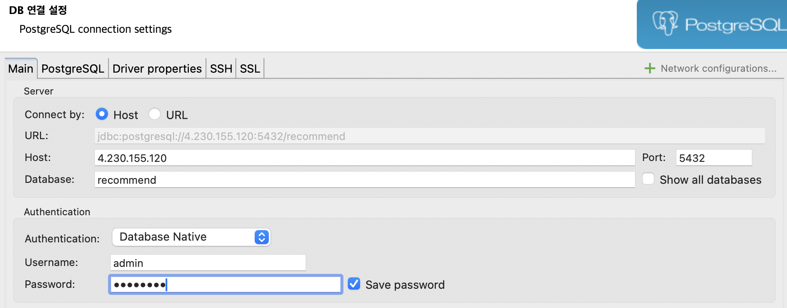

# Coding 가이드 

## 목차
- [Coding 가이드](#coding-가이드)
  - [목차](#목차)
  - [개발](#개발)
  - [AKS/ACR 생성](#aksacr-생성)
  - [Database 설치](#database-설치)

---

## 개발
- 코딩 
  ```
  c: 개발을 시작해 주세요. 개발 방식은 WebMVC를 사용하세요. 
  ```   
- 프로젝트 생성
  윈도우 사용자는 local ubuntu에서 작업하고 맥 사용자는 로컬 터미널에서 작업합니다. 
  작업 디렉토리를 생성합니다. {사용자홈}/home/workspace를 작성합니다. 
   
  ```
  mkdir -p ~/workspace 
  cd ~/workspace
  ```

  개발된 소스를 한 파일로 합칩니다. 'workspace'디렉토리에 만들고 파일명은 'src.txt'로 합니다.    
  genprj.py를 이용하여 프로젝트를 생성합니다.  
  ```
  $ python genprj.py src.txt lifesub m
  ```

  intelliJ에서 프로젝트를 오픈 합니다. 

- 프로그램 보완
  1차 코딩 완료 후 실행을 위한 모든 코드가 개발되었는지 체크
  ```
  o: 실행을 위해 필요한 모든 클래스가 개발되었는지 체크해 주세요.
  ```

  2차 코딩 완료 후 재 확인
  ```
  o: 다시 한번 누락된 클래스가 없는지 검토해 주세요.
  ```

- 에러 Fix
  IntelliJ에서 에러 텍스트를 복사하거나, 이미지 캡처하여 제공  
  반드시, 제일 상단에 있는 class명이 포함되게 캡처 해야 함  
    

| [Top](#목차) |

---

## AKS/ACR 생성
[서버 작업 환경 설정](https://github.com/cna-bootcamp/handson-azure/blob/main/prepare/setup-server.md#aksacr-%EC%83%9D%EC%84%B1-%EC%82%AD%EC%A0%9C)을 참조하여 아래 작업을 합니다. 

- Azure CLI 설치 및 로그인(Windows Only)
- Azure CLI 설치 및 로그인(Mac Only)
- 기본 Configuration 설정
- AKS/ACR 생성

| [Top](#목차) |

---

## Database 설치
각 서비스별 아래 Database를 설치 합니다.   
- member서비스: member
- mysub 서비스: mysub
- recommend 서비스: recommend

아래 내용으로 'deploy-db.sh'라는 파일을 만듭니다.
```
#!/bin/bash

# Namespace 존재 여부 확인 후 생성
if ! kubectl get namespace lifesub-ns &> /dev/null; then
    kubectl create namespace lifesub-ns
fi

# Namespace 전환
kubens lifesub-ns

# 각 서비스별 설정 및 배포
for service in member mysub recommend; do
    # values 파일 생성
    cat << EOF > values-${service}.yaml
# PostgreSQL 아키텍처 설정
architecture: standalone
# 글로벌 설정
global:
  postgresql:
    auth:
      postgresPassword: "Passw0rd"
      replicationPassword: "Passw0rd" 
      database: "${service}"
      username: "admin"
      password: "Passw0rd"
  storageClass: "managed"
  
# Primary 설정
primary:
  persistence:
    enabled: true
    storageClass: "managed"
    size: 10Gi
  
  resources:
    limits:
      memory: "1Gi"
      cpu: "1"
    requests:
      memory: "0.5Gi"
      cpu: "0.5"
  
# 네트워크 설정
service:
  type: ClusterIP
  ports:
    postgresql: 5432
# 보안 설정
securityContext:
  enabled: true
  fsGroup: 1001
  runAsUser: 1001
EOF

    # Service 파일 생성
    cat << EOF > svc-${service}.yaml
apiVersion: v1
kind: Service
metadata:
  name: ${service}-external
spec:
  ports:
  - name: tcp-postgresql
    port: 5432
    protocol: TCP
    targetPort: tcp-postgresql
  selector:
    app.kubernetes.io/component: primary
    app.kubernetes.io/instance: ${service}
  sessionAffinity: None
  type: LoadBalancer
EOF

    # Helm으로 PostgreSQL 설치
    helm upgrade -i ${service} -f values-${service}.yaml bitnami/postgresql --version 14.3.2
    
    # 외부 서비스 생성
    kubectl apply -f svc-${service}.yaml
done
```

shell을 실행 합니다.
```
chmod +x ./deploy-db.sh
./deploy-db.sh
```

Pod가 모두 실행될때까지 기다립니다.
```
k get po
```

Service중 'external'로 끝나는 객체의 'EXTERNAL-IP'를 확인합니다.

DBeaver를 실행하여 각 DB가 연결되는지 확인 합니다.


| [Top](#목차) |

---


