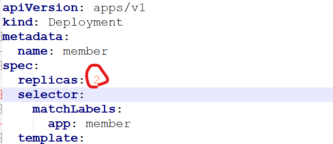
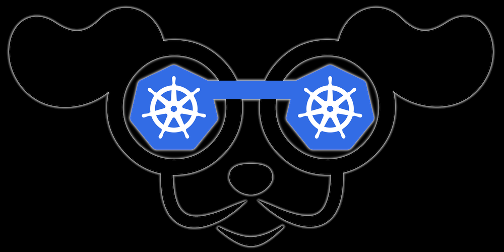

# 쿠버네티스 명령어 실습

## 목차  
- [쿠버네티스 명령어 실습](#쿠버네티스-명령어-실습)
  - [목차](#목차)
  - [로그인](#로그인)
  - [객체 생성 및 수정: kubectl apply](#객체-생성-및-수정-kubectl-apply)
  - [객체 리스트 조회: kubectl get](#객체-리스트-조회-kubectl-get)
  - [객체 정보 보기: kubectl describe](#객체-정보-보기-kubectl-describe)
  - [파드 로그 보기: kubectl logs \[-f\]](#파드-로그-보기-kubectl-logs--f)
  - [파드 내 명령 내리기: kubectl exec -it](#파드-내-명령-내리기-kubectl-exec--it)
  - [객체 수정: kubectl edit](#객체-수정-kubectl-edit)
  - [객체 삭제: kubectl delete](#객체-삭제-kubectl-delete)
  - [수동 스케일링: kubectl scale](#수동-스케일링-kubectl-scale)
  - [파드 재시작 하기: kubectl rollout](#파드-재시작-하기-kubectl-rollout)
  - [k8s 클러스터 외부에서 포트 Forward하여 파드 접근하기: kubectl port-forward](#k8s-클러스터-외부에서-포트-forward하여-파드-접근하기-kubectl-port-forward)
  - [유지보수 관련 명령: cordon, uncordon, drain, taint](#유지보수-관련-명령-cordon-uncordon-drain-taint)
  - [k9s](#k9s)


## 로그인
Window사용자는 MobaXTerm의 Local Ubuntu에서 작업하고 맥/리눅스 사용자는 터미널에서 작업하십시오.    

작업 디렉토리를 만들고 이동합니다.   
```
mkdir -p ~/work && cd ~/work
```

## 객체 생성 및 수정: kubectl apply    
Deployment 매니페스트가 있는 디렉토리로 이동합니다.  
```
cd ~/workspace/lifesub/deployment/manifest/deployments/
ll
```

좌측 WSL Browser에서 member-deployment.yaml 파일을 더블클릭하여 NotePad++에서 엽니다.  
  

replicas를 2로 수정하고 저장합니다.  
 

현재 member 파드의 갯수를 확인해 보세요.  1개만 있을 겁니다.   
아래 명령으로 매니페스트 내용을 적용하고 2개로 늘어 나는지 확인 합니다.    
```
k apply -f member-deployment.yaml  
k get po 
```

| [Top](#목차) |

---

## 객체 리스트 조회: kubectl get 
생성된 모든 오브젝트들을 봅니다.  
```
kubectl get all
```

각 리소스 종류별로 오브젝트를 조회합니다.  
```
k get po
k get deploy
k get sts
k get svc
k get ing
k get cm
k get secret
k get pv
k get pvc
```

다른 네임스페이스의 오브젝트도 조회 해 봅니다. 
위 명령 끝에 '-n {조회할 네임스페이스명}'을 붙이면 됩니다.  
```
kubectl get po -n kube-system
```

오브젝트의 yaml 내용을 조회해 봅니다.   
```
kubectl get deploy member -o yaml
```

yaml내용을 파일로 저장해 봅니다.  
```
kubectl get deploy member -o yaml > tmp.yaml 
```

오브젝트의 label을 조회해 봅니다.  pod이름은 본인 것으로 변경해야 합니다.   
```
kubectl get deploy member --show-labels
k get po
kubectl get po {pod명} --show-labels  
```

오브젝트의 좀 더 많은 정보를 '-o wide'를 붙여 확인합니다.   
```
kubectl get deploy member -o wide --show-labels
kubectl get po node -o wide --show-labels  
```

모든 네임 스페이스에서 오브젝트 리스트를 확인 합니다.   
```
kubectl get po -A
kubectl get deploy -A
kubectl get svc -A
kubectl get ing -A
```

아래는 자주 사용하는 k8s 리소스입니다.  
  

전체 리소스를 보려면 아래 명령으로 보면 됩니다.  
```
k api-resources
```

| [Top](#목차) |

---

## 객체 정보 보기: kubectl describe  
원하는 객체의 정보를 조회 합니다.   
```
k get po
kubectl describe po {pod명}
kubectl describe deploy member
kubectl describe svc member
```

가장 많이 사용 하게될 리소스는 pod 일 것입니다.   
파드가 제대로 실행 안 되었을 때 그 원인을 찾을 때 describe를 매우 많이 사용합니다.  

아래 예와 같이 'Events' 부분을 보고 문제를 해결해 나갑니다.   
이미지를 풀링 실패, Readiness Probe 실패, 런타임 실패로 재시작 등이 많이 나오는 유형입니다.  
```
k get po | grep member
member-569f6b555d-jggww        1/1     Running   0              6m56s
member-569f6b555d-ksrvc        1/1     Running   0              7h36m
member-postgresql-0            1/1     Running   2 (8h ago)     14h


k describe po member-569f6b555d-jggww

...

Events:
  Type    Reason     Age   From               Message
  ----    ------     ----  ----               -------
  Normal  Scheduled  7m5s  default-scheduler  Successfully assigned dg0200-lifesub-ns/member-569f6b555d-jggww to aks-nodepool1-18726331-vmss000006
  Normal  Pulling    7m5s  kubelet            Pulling image "dg0200cr.azurecr.io/lifesub/member:1.0.0"
  Normal  Pulled     7m5s  kubelet            Successfully pulled image "dg0200cr.azurecr.io/lifesub/member:1.0.0" in 209ms (209ms including waiting). Image size: 375474773 bytes.
  Normal  Created    7m5s  kubelet            Created container member
  Normal  Started    7m5s  kubelet            Started container member

```

| [Top](#목차) |

---

## 파드 로그 보기: kubectl logs [-f]
파드 로그를 확인해 봅니다.  
```
k get po 
kubectl logs member-569f6b555d-jggww
```

'-f'옵션을 붙이면 log를 실시간 스트리밍할 수 있습니다.   

```
k get po | grep recommend
recommend-6c6f858486-bpz9l     1/1     Running   0               7h43m
recommend-postgresql-0         1/1     Running   1 (12h ago)     14h

kubectl logs -f recommend-6c6f858486-bpz9l
```

deploy객체를 이용하여 관리하는 파드의 로그를 볼 수도 있습니다.   
파드명은 재생성하면 바뀌므로 파드가 1개일 때는 deploy를 이용 하기도 합니다.  
'/'로 구분하여 지정한다는거에 유의하세요.   
```
k logs -f deploy/member 
```

그리고 웹 브라우저에서 구독서비스를 로그인한 후 메인화면을 리프레시 해 보십시오.  
로그가 실시간으로 나오는 걸 확인할 수 있습니다.  

CTRL-C를 눌러 빠져 나오세요.  

만약 Pod안에 container가 2개 이상이면 '-c' 옵션으로 로그를 볼 컨테이너명을 지정해 줘야 합니다.   

| [Top](#목차) |

---

## 파드 내 명령 내리기: kubectl exec -it 

docker exec에서는 명령 앞에 아무것도 없었으나 kubectl은 '--'를 붙여줘야 수행됩니다.   
'--' 뒤에 파드 내에 내릴 명령을 입력하면 됩니다.   
```
k exec -it member-569f6b555d-jggww -- ls -al /
```

아래 명령으로 파드 내부로 진입합니다.  
진입 후 pwd로 현재 위치를 확인해 보고, ls -al로 app.jar파일이 있는지 확인합니다.   
Dockerfile에서 WORKDIR로 현재 디렉토리를 지정하고 COPY명령으로 jar를 복사했다는 것을 떠올리시길 바랍니다.  

```
kubectl exec -it member-569f6b555d-jggww -- bash

pwd
ls -al
```
exit를 입력하여 파드를 빠져 나옵니다.  


| [Top](#목차) |

---

## 객체 수정: kubectl edit
예제로 Service 객체를 수정해 보겠습니다.   
아래 명령으로 Service 'member'의 편집 모드로 진입합니다.   
```
kubectl edit svc member
```

맨 끝에 쯤 있는 type: ClusterIP를 type: NodePort로 변경합니다.  
ESC를 누르고 ':wq'를 눌러 저장하고 닫습니다.   

Service를 조회해 봅니다.  뭐가 달라졌나요?  
```
kubectl get svc
```

PORT(S)의 ':' 뒤에 있는 포트가 외부 포트입니다.  이 포트로 브라우저에서 접근해 보십시오.   
예를 들어 외부 포트가 31677이면 아래와 같이 접근할 수 있습니다.   
이때 Host는 k8s 노드중 아무 노드의 Public IP를 지정하면 됩니다.   
우리는 k8s 노드들이 외부에 오픈 안되어 있으므로 테스트는 못하겠네요.  
```
http://43.200.12.214:31677/swagger-ui.html  
```

| [Top](#목차) |

---

## 객체 삭제: kubectl delete  
파드를 삭제 해 보십시오.  
```
k get po | grep mysub
kubectl delete po {mysub pod명}
```

1개 뿐인 파드를 지웠으니 이제 파드는 하나도 없겠네요.    
다시 한번 파드 리스트를 확인해 보세요.   
파드가 있습니다.  안 지워진걸까요? 누가 다시 만든걸까요?     
잘 보시면 파드이름이 그 전 파드와 다릅니다. 다시 만들어진겁니다.     
누가 다시 만들었을까요?  쿠버네티스 아키텍처에서 어떤 컴포넌트일까요?      
  
Controller Manager입니다.  
  

어떤 리소스가 다시 만든걸까요?  

Workload Controller입니다.  그 중에서도 mysub 파드를 관리하는 Deployment 'mysub'객체입니다.  

  
그럼 파드를 완전히 삭제하려면 어떻게 해야 할까요?    
파드를 배포한 워크로드 컨트롤러를 삭제해야 합니다.   
   
아래와 같이 deployment 객체를 지워 보십시오.   
```
kubectl delete deploy mysub   
```

이제 파드를 조회 해 보면 삭제되었을 겁니다.   

리소스유형을 지정하여 해당 리소스로 생성된 모든 객체를 삭제할 수 있습니다.   
아래 명령으로 모든 service객체를 삭제해 보십시오.  
```
kubectl delete svc --all
```
> 주의: Secret은 한꺼번에 삭제 하지 마세요.   
> 이렇게 한꺼번에 삭제하는 건 실수 할 수 있으니 가급적 사용하지 마세요.    

yaml 파일을 지정하여 그 파일에 정의된 객체를 한꺼번에 삭제할 수 있습니다.   
```
kubectl delete -f mysub-deployment.yaml
```

파드 객체 리스트를 조회해 보면 모두 사라진 걸 확인할 수 있을겁니다.   
```
k get svc deploy 
```

파드가 잘 삭제 안될 경우가 있습니다.  
강제로 삭제하는 방법으로 '--force'와 '--grace-period=0'을 같이 쓰면 즉시 삭제 됩니다.  
```
k get po | grep member
k delete member-569f6b555d-jggww
k get po | grep member 
k delete po member-569f6b555d-jggww --force --grace-period=0
k get po | grep member
```


다시 실습을 위해 지운 객체를 다시 생성합니다.   
바로 위 디렉토리로 이동하여 deployments와 services 디렉토리를 지정하여 생성해 봅니다.   
```
cd ..

k apply -f deployments
deployment.apps/member configured
deployment.apps/mysub configured
deployment.apps/recommend configured

k apply -f services
service/member unchanged
service/mysub unchanged
service/recommend unchanged

```

| [Top](#목차) |

---

## 수동 스케일링: kubectl scale   
파드의 갯수를 수동으로 조정할 수 있습니다.  
```
k scale --replicas=2 deploy member 
```

파드를 일시적으로 중단시키는 방법으로 응용할 수도 있습니다.  
```
k scale --replicas=0 deploy member 
```

다시 원복 합니다.  
```
k scale --replicas=1 deploy member 
```

| [Top](#목차) |

---

## 파드 재시작 하기: kubectl rollout 
파드를 관리하는 Workload Controller 객체를 이용하여 파드를 재시작 할 수 있습니다.   
```
k get po | grep member
member-555df65b6c-2rhxc        1/1     Running   0               83s
...

# deployment객체를 이용하여 파드를 재시작합니다.  
k rollout restart deploy member
deployment.apps/member restarted

# 파드명을 잘 보면 1번째는 기존 파드이고, 2번째 새로운 파드가 시작되었습니다.  
k get po | grep member
member-555df65b6c-2rhxc        1/1     Running   0               4m45s
member-64945c6c44-x5228        0/1     Running   0               4s
...

# 예전 파드를 강제로 삭제합니다. (기본으로 30초 동안 유지됩니다. )
k delete po member-555df65b6c-2rhxc --force --grace-period=0
Warning: Immediate deletion does not wait for confirmation that the running resource has been terminated. The resource may continue to run on the cluster indefinitely.
pod "member-555df65b6c-2rhxc" force deleted

# 새로운 파드가 정상적으로 시작 되었습니다.  
k get po | grep member
member-64945c6c44-x5228        1/1     Running   0               50s
member-postgresql-0            1/1     Running   2 (9h ago)      15h

```

| [Top](#목차) |

---

## k8s 클러스터 외부에서 포트 Forward하여 파드 접근하기: kubectl port-forward 
개발 시ㅣ 테스트 목적으로 클라이언트에서 파드를 접근하여야 할 경우가 자주 있습니다.  
파드는 서비스 리소스를 통해 접근 하므로 서비스를 포트 Forward 하면 됩니다.   
서비스의 유형이 어떤 것이든 모두 됩니다.

아래와 같이 member 서비스를 포트 Forward 합니다.  
아래 작업은 Local Ubuntu에서 반드시 해야 합니다.  
```
k port-forward svc/member 8888:80
```

웹브라우저에서 http://localhost:8888/swagger-ui.html 으로 접근합니다.  


| [Top](#목차) |

---

## 유지보수 관련 명령: cordon, uncordon, drain, taint
각 명령어들은 쿠버네티스 노드 관리를 위한 kubectl 명령어들입니다.    

1.cordon/uncordon: 노드에 새로운 파드가 스케줄링되는 것을 방지하거나 방지 해제  
cordon 된 노드는 STATUS에 'SchedulingDisabled'라고 표시됩니다.     
```bash
ubuntu@dreamondal:~$ k get nodes
NAME                                STATUS   ROLES    AGE    VERSION
aks-nodepool1-18726331-vmss000000   Ready    <none>   2d9h   v1.30.9
aks-nodepool1-18726331-vmss000001   Ready    <none>   2d9h   v1.30.9
aks-nodepool1-18726331-vmss000006   Ready    <none>   18h    v1.30.9
aks-nodepool1-18726331-vmss000008   Ready    <none>   9h     v1.30.9
ubuntu@dreamondal:~$ k cordon aks-nodepool1-18726331-vmss000008
node/aks-nodepool1-18726331-vmss000008 cordoned
ubuntu@dreamondal:~$ k get nodes
NAME                                STATUS                     ROLES    AGE    VERSION
aks-nodepool1-18726331-vmss000000   Ready                      <none>   2d9h   v1.30.9
aks-nodepool1-18726331-vmss000001   Ready                      <none>   2d9h   v1.30.9
aks-nodepool1-18726331-vmss000006   Ready                      <none>   18h    v1.30.9
aks-nodepool1-18726331-vmss000008   Ready,SchedulingDisabled   <none>   9h     v1.30.9
ubuntu@dreamondal:~$ k uncordon aks-nodepool1-18726331-vmss000008
node/aks-nodepool1-18726331-vmss000008 uncordoned
ubuntu@dreamondal:~$ k get nodes
NAME                                STATUS   ROLES    AGE    VERSION
aks-nodepool1-18726331-vmss000000   Ready    <none>   2d9h   v1.30.9
aks-nodepool1-18726331-vmss000001   Ready    <none>   2d9h   v1.30.9
aks-nodepool1-18726331-vmss000006   Ready    <none>   18h    v1.30.9
aks-nodepool1-18726331-vmss000008   Ready    <none>   9h     v1.30.9
```

2.drain: 노드의 파드들을 다른 노드로 이동  
노드의 유지보수 준비를 위해 모든 파드를 내쫒는 명령입니다.  
실습하지는 마세요.  
```bash
# node1의 모든 파드를 다른 노드로 이동
kubectl drain node1 --ignore-daemonsets
```

3.taint: 노드에 테인트를 설정하여 파드 스케줄링 제어   
cordon처럼 노드에 모든 스케쥴링을 금지하는게 아니라 특정 조건에 해당하는 파드만 스케쥴링 하기 위한 목적으로 사용됩니다.  

아래 예에서 normal-pod는 node1에 스케줄링되지 않고, tolerating-pod는 스케줄링이 될 수 있습니다.  
테인트가 걸린 노드에 파드를 배포할 때는 'tolerations' 조건을 이용합니다.  
```
# 1. 노드에 테인트 설정
kubectl taint nodes node1 app=blue:NoSchedule

# 2. 톨러레이션이 없는 일반 파드
apiVersion: v1
kind: Pod
metadata:
  name: normal-pod
spec:
  containers:
  - name: nginx
    image: nginx

# 3. 톨러레이션이 있는 파드
apiVersion: v1
kind: Pod
metadata:
  name: tolerating-pod
spec:
  containers:
  - name: nginx
    image: nginx
  tolerations:
  - key: "app"
    operator: "Equal"
    value: "blue"
    effect: "NoSchedule"
```

| [Top](#목차) |

---

## k9s
[k9s](https://k9scli.io/)는 쿠버네티스 클러스터 관리를 도와주는 편리한 툴입니다.   
  

아래 글에서 설치와 사용법을 익히십시오.  
https://happycloud-lee.tistory.com/237

| [Top](#목차) |

---


